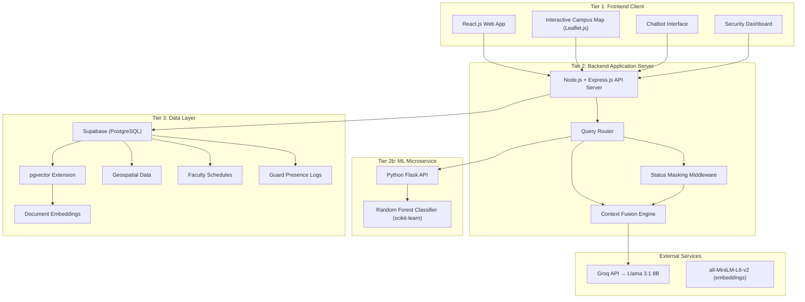

# ISU-GeoBot Thesis — Structured Analysis

> **Source document:** [ISU_GeoBot_revised1.pdf](file:///c:/Users/Admin/Desktop/thesis-website/ISU_GeoBot_revised1.pdf)
> **Authors:** Michael Allan Almario, Christian Paul Simbulan
> **Degree:** BSCS – Data Mining Track, College of Computing Studies, ICT, Isabela State University – Echague

Legend used throughout:
- ✅ **Explicitly stated** — directly quoted or paraphrased from the thesis
- 🔶 **Reasonable interpretation** — logically inferred from stated content
- ❌ **Not specified** — the thesis does not address this

---

## 1. Research Problem

✅ **Explicitly stated.**

The thesis identifies a two-part problem at the ISU Echague Main Campus:

1. **Spatial disorientation** — Students, especially incoming freshmen, have difficulty independently locating faculty offices, navigating between college buildings, and determining faculty availability. Current navigation tools consist only of printed maps and isolated departmental schedules with no centralized or digital access point.

2. **Information asymmetry** — Existing tools provide only static geographic information and do not reflect real-time campus activity (faculty availability, schedule changes, academic events). Students must visit multiple locations or consult different offices to confirm faculty availability.

Additionally, the thesis identifies a **technical research gap**: no existing study has demonstrated an "Enhanced RAG" architecture that augments standard document-retrieval with real-time probabilistic outputs from a machine learning classifier within a unified pipeline. Existing RAG systems in the literature operate as purely retrieval-based systems retrieving static documents.

---

## 2. General and Specific Objectives

### General Objective

✅ Develop ISU-GeoBot, a web-based campus navigation assistant that integrates a Random Forest classifier into a Retrieval-Augmented Generation (RAG) architecture to provide context-aware, privacy-compliant probabilistic estimates of faculty availability for the ISU Echague Main Campus.

### Specific Objectives

| # | Objective | Source |
|---|-----------|--------|
| 1 | Integrate a Random Forest classifier into the RAG pipeline to estimate the probability of real-time faculty availability based on temporal schedule data | ✅ Sec 1.2 |
| 2 | Evaluate and compare the performance of the standard and Enhanced RAG architectures in terms of Response Time and RAGAS metrics (Context Precision, Context Recall, Faithfulness, Answer Relevancy) | ✅ Sec 1.2 |
| 3 | Deploy the Enhanced RAG architecture within the web-based ISU-GeoBot system to provide context-aware campus navigation and privacy-compliant faculty availability information | ✅ Sec 1.2 |
| 4 | Evaluate the functional accuracy and reliability of the system's faculty availability probability estimates through ground-truth validation by selected faculty members | ✅ Sec 1.2 |

---

## 3. Proposed System Functionality

✅ **All items below are explicitly stated in the thesis (Sections 3.5, 3.5.1–3.5.4).**

| Functional Area | Description |
|-----------------|-------------|
| **Interactive Campus Map** | Web-based map using Leaflet.js rendering GPS coordinates of buildings, offices, departments, and points of interest within ISU Echague Main Campus |
| **Context-Aware Navigation** | Location-aware responses linking departments, building functions, and faculty information to geospatial data points |
| **Chatbot Interface** | Natural language query interface where users submit questions about faculty availability, building directions, and institutional information |
| **Faculty Availability Classification** | Random Forest classifier estimates probability that a faculty member is present and available, outputting one of three statuses: "Available for Consultation," "Currently in a Lecture," or "Unavailable" |
| **Status Masking Protocol** | Three-step privacy middleware: (1) capture raw RF classification, (2) map sensitive location keys → generalized status via hash map, (3) purge raw location from memory before LLM injection |
| **Deterministic Security Override** | System first checks guard/security presence logs in Supabase; if faculty confirmed as off-campus, the system bypasses AI and returns "Unavailable" directly |
| **Enhanced RAG Pipeline** | Document retrieval (vectorized institutional documents) + Context Fusion (merge retrieved chunks + masked RF status + user query into single LLM prompt) |
| **Security Dashboard** | Dedicated frontend dashboard for security personnel to manually log campus presence (real-time manual campus presence tracking) |
| **Document Retrieval** | Ingestion, chunking, vectorization, and semantic retrieval of institutional documents (memoranda, academic calendars, announcements, faculty directories) |

---

## 4. Scope and Limitations

### In Scope ✅

- Enhancement of the RAG architecture by integrating a Random Forest classifier ("Enhanced RAG")
- Geospatial coverage: major academic buildings, colleges, and administrative offices within ISU Echague Main Campus
- Implementation as a web-based system for cross-device accessibility
- Status masking for privacy compliance
- Technical AI Evaluation comparing standard RAG vs. Enhanced RAG using RAGAS metrics
- Functional Validation by 15 selected faculty members/department staff across ≥ 5 distinct academic departments

### Limitations / Delimitations ✅

- The system outputs **generalized availability statuses**, not exact physical room coordinates
- The core contribution is the integration and evaluation of the Enhanced RAG architecture (not a general-purpose campus management system)
- Faculty validators are the only evaluation respondents (no student usability evaluation is described as part of this study)
- The thesis uses a **Developmental Research Design** — it does not test causal relationships between variables

### 🔶 Reasonable Interpretations of Unstated Limitations

- The system is limited to the **ISU Echague Main Campus** and is not designed for generalization to other institutions without re-collecting all data
- The RF model is trained on ISU-specific schedule/attendance data; it has **no transfer learning** capability
- The Groq API free-tier dependency introduces a **single point of failure** and potential rate-limiting
- ❌ No offline mode or fallback if Groq API is unavailable is discussed
- ❌ No mention of multi-language support (e.g., Filipino/Ilocano)

---

## 5. Users and Stakeholders

✅ **Explicitly stated in Section 1.4 (Significance of the Study).**

| Stakeholder | Benefit Described |
|-------------|-------------------|
| **Students** | Improved campus navigation, context-aware location guidance, access to faculty availability information, reduced spatial disorientation |
| **Faculty Members** | Improved communication with students, reduced interruptions and unnecessary office visits via estimated availability status |
| **University Administrators** | Digital tool for managing/disseminating campus information, supporting institutional modernization |
| **The Institution (ISU)** | Intelligent navigation without requiring additional physical infrastructure (kiosks, etc.) |
| **Future Researchers** | Reference for intelligent campus systems, GIS, and AI in higher education |
| **Body of Knowledge** | Novel integration of probabilistic ML with RAG in a localized campus context |

✅ **Additional user role explicitly mentioned (Section 3.5 architecture):**

| User Role | Function |
|-----------|----------|
| **Security Personnel** | Manual campus presence logging via a dedicated security dashboard |

🔶 **Reasonable interpretation:** Security personnel are *data contributors*, not primary end-users of the chatbot/navigation features.

❌ **Not specified:** Whether administrators have a dedicated admin panel, how faculty data (schedules) is entered/updated in the system, or whether faculty members themselves have any system interaction beyond the validation study.

---

## 6. Functional Requirements Explicitly Supported by the Thesis

The thesis does not present a formal requirements table, but the following functional requirements can be **directly extracted** from the system architecture (Section 3.5) and methodology:

| ID | Functional Requirement | Source |
|----|----------------------|--------|
| FR-01 | The system shall display an interactive campus map showing buildings, offices, departments, and points of interest with GPS coordinates | ✅ Sec 3.5.1 |
| FR-02 | The system shall accept natural language user queries via a chatbot interface | ✅ Sec 3.5.4 |
| FR-03 | The system shall classify faculty availability into three categories: "Available for Consultation," "Currently in a Lecture," or "Unavailable" | ✅ Sec 3.5.2 |
| FR-04 | The system shall use a Random Forest classifier trained on temporal schedule data and historical attendance patterns | ✅ Sec 3.5.2 |
| FR-05 | The system shall implement a status masking protocol that transforms raw RF outputs into generalized statuses before LLM injection | ✅ Sec 3.5.3 |
| FR-06 | The system shall never store, transmit, or display exact physical locations of faculty members to end users | ✅ Sec 3.5.3 |
| FR-07 | The system shall check deterministic security/guard presence logs before invoking the RF classifier; if faculty is confirmed off-campus, return "Unavailable" directly | ✅ Sec 3.5.3 (code sample) |
| FR-08 | The system shall retrieve semantically relevant document chunks from a vector store using cosine similarity | ✅ Sec 3.5.4 |
| FR-09 | The system shall perform Context Fusion: merge user query + retrieved document chunks + masked RF status into a structured LLM prompt | ✅ Sec 3.5.4 |
| FR-10 | The system shall generate natural language responses using the Llama 3.1 8B model via Groq API | ✅ Sec 3.5.4, 3.7 |
| FR-11 | The system shall provide a dedicated security dashboard for security personnel to manually log faculty campus presence | ✅ Sec 3.5 (architecture overview) |
| FR-12 | The system shall associate each geospatial data point with contextual metadata (department name, building function, linked faculty information) | ✅ Sec 3.5.1 |
| FR-13 | The system shall route queries to the appropriate module: RF Prediction Module for faculty availability queries, or RAG Pipeline for document-based queries | ✅ Sec 3.5 |

---

## 7. Non-Functional Requirements Explicitly Supported by the Thesis

| ID | Non-Functional Requirement | Source |
|----|---------------------------|--------|
| NFR-01 | **Privacy compliance**: RA 10173 (Data Privacy Act of 2012) — no PII stored, transmitted, or displayed | ✅ Sec 3.10 |
| NFR-02 | **Cross-device accessibility**: Web-based system accessible across different devices | ✅ Sec 1.3 |
| NFR-03 | **Response time**: Measured as a comparison metric between standard RAG and Enhanced RAG | ✅ Sec 1.2 (Specific Objective 2) |
| NFR-04 | **Ethical data handling**: Attendance records sanitized and anonymized before processing | ✅ Sec 3.4 Phase 1 |
| NFR-05 | **Modularity**: Each component (geospatial, RF, RAG, frontend) independently developable and testable | ✅ Sec 3.6.3 |
| NFR-06 | **Separation of concerns**: RF model deployed as a separate Python Flask microservice, invoked by Node.js backend via HTTP | ✅ Sec 3.7 |

### ❌ Not Specified

- Specific response time targets or SLAs
- Concurrent user capacity / scalability requirements
- Availability / uptime requirements
- Security measures beyond status masking (authentication, authorization, HTTPS, API key protection)
- Browser compatibility requirements
- Accessibility (WCAG) requirements
- Data backup / disaster recovery

---

## 8. System Architecture and Major Modules

✅ **Explicitly described in Section 3.5 with an architecture diagram (Figure 5).**

### Three-Tier Architecture



### Four Core Modules

| Module | Responsibility | Key Technology |
|--------|---------------|----------------|
| **1. Geospatial Navigation Module** | Spatial backbone: stores/renders campus coordinates, offices, POIs; provides location-aware responses | Leaflet.js, Supabase (geospatial data) |
| **2. Random Forest Classification Module** | Classifies faculty availability from temporal + historical features; outputs probability estimates | Python 3.11, scikit-learn 1.4, Flask API |
| **3. Status Masking Protocol** | Privacy middleware: intercepts raw RF output, maps to generalized status via hash map, purges raw data | Node.js middleware |
| **4. Enhanced RAG Pipeline + Context Fusion** | Document ingestion/chunking/embedding, semantic retrieval, fusion of retrieved docs + masked status + query, LLM response generation | all-MiniLM-L6-v2, pgvector, Groq API (Llama 3.1 8B) |

---

## 9. AI/ML Components and Their Intended Roles

| Component | Role | Details |
|-----------|------|---------|
| **Random Forest Classifier** | Probabilistic classification of faculty availability | ✅ Trained on: (a) static temporal features (day, time, semester), (b) historical attendance patterns, (c) institutional event indicators (binary flags for convocations, assemblies, enrollment), (d) contextual features (proximity to exams, breaks). Uses Gini Impurity for splitting. 80/20 train-test split with cross-validation. Three output classes: Available, Late/In-Lecture, Absent/Unavailable. |
| **all-MiniLM-L6-v2** | Sentence embedding model | ✅ Produces 384-dimensional vector embeddings for document chunks and user queries. Chosen for lightweight inference (no GPU required) and proven semantic retrieval performance. |
| **Llama 3.1 8B** | Large Language Model for response synthesis | ✅ Accessed via Groq API. Selected for: (1) open-source with permissive license, (2) strong instruction-following, (3) free-tier availability via Groq. Acts as the central synthesizer merging retrieved documents and predictive outputs into natural language. |
| **RAGAS Framework** | Automated RAG pipeline evaluation | ✅ Four metrics: Context Precision, Context Recall, Faithfulness, Answer Relevancy. Used to compare standard RAG vs. Enhanced RAG. |

### 🔶 Reasonable Interpretations

- The Gini Impurity classes listed are "Available, Late, Absent" (Section 3.5.2), but the user-facing statuses are "Available for Consultation," "Currently in a Lecture," "Unavailable." The status masking protocol maps between these.
- The thesis mentions `predict_proba` (probability outputs) but the final presentation to users is categorical, not numerical probabilities.

### ❌ Not Specified

- Hyperparameters for the Random Forest (number of trees, max depth, etc.)
- How the query router determines whether a query is "faculty-related" vs. "general institutional" vs. "navigation"
- Whether the embeddings model runs locally on the server or via an API
- Chunking strategy details (chunk size, overlap)
- Prompt engineering details / system prompt templates for the LLM

---

## 10. Data Sources and Data Flow

✅ **Explicitly described in Section 3.4.1 (Data Gathering Diagram — Figure 4) and Section 3.5.**

### Three Parallel Data Streams

| Stream | Data Sources | Processing | Output | Destination Module |
|--------|-------------|------------|--------|-------------------|
| **(a) Geospatial** | Campus floor plans from admin; on-site GPS mapping via mobile devices; cross-referencing with physical landmarks | Verification against physical landmarks | Verified spatial coordinates dataset | Geospatial Navigation Module |
| **(b) Temporal Schedule + Attendance** | Official faculty class schedules from department heads; historical attendance logs from departmental logbooks or HR biometric systems | Digitization into structured temporal variables; sanitization and anonymization of attendance records (RA 10173 compliance) | Structured temporal and attendance feature matrix | Random Forest Classification Module |
| **(c) Institutional Documents** | University memoranda, student handbooks, academic calendars, department announcements from administrative offices | Formatting to machine-readable PDF/text; segmentation into text chunks; vector embedding via all-MiniLM-L6-v2 | Unstructured document corpus → vectorized embeddings | RAG Pipeline (pgvector in Supabase) |

### Additional Real-Time Data

| Data | Source | Module |
|------|--------|--------|
| **Manual campus presence logs** | Security personnel via the Security Dashboard | Status Masking Protocol (deterministic override check) |
| **User queries** | Students / campus users via chatbot interface | Query Router → RF Module and/or RAG Pipeline |

### Data Flow Summary

```
User Query → Query Router
  ├─► [Faculty query] → Check Guard Logs (Supabase)
  │     ├─► Off-campus → "Unavailable" (bypass AI)
  │     └─► On-campus → RF Classifier (Flask API) → Raw prediction
  │           → Status Masking (hash map + purge)
  │           → Masked status string
  ├─► [Any query] → RAG Pipeline → Query embedding
  │     → Cosine similarity search on pgvector
  │     → Top-K relevant document chunks
  └─► Context Fusion: [Query + Docs + Masked Status]
        → Llama 3.1 8B (Groq API)
        → Natural language response → User
```

---

## 11. Privacy and Status-Masking Requirements

✅ **Explicitly and thoroughly described in Sections 3.5.3, 3.10.**

### Core Privacy Principle

> "At no point will the system store, transmit, or display the exact physical location of any faculty member to the end user." — Section 3.5.3

### Status Masking Protocol (Three Steps)

| Step | Action | Detail |
|------|--------|--------|
| 1. Raw Inference Capture | RF model outputs a raw location class | e.g., `Class_Room_302`, `Off_Campus_Tag` |
| 2. Associative Mapping | Hash map translates raw output to generalized status | `Room_304` → "Currently in a Lecture"; `Faculty_Lounge` → "Available for Consultation" |
| 3. Data Purging + LLM Injection | Raw location variable purged from active session memory; only sanitized string transmitted to LLM | `rawPrediction = null;` |

### Deterministic Override

✅ Before invoking the RF classifier, the system checks guard/security presence logs in Supabase. If the faculty member has been confirmed as having left campus, the system **bypasses the AI entirely** and returns "Unavailable."

### Legal Framework

✅ The system is designed to comply with **Republic Act No. 10173 (Data Privacy Act of 2012)**.

### Additional Privacy Measures

- ✅ Attendance records sanitized and anonymized before use as training features (retaining only temporal patterns)
- ✅ Survey responses collected anonymously
- ✅ No PII stored, transmitted, or displayed

### ❌ Not Specified

- How the hash map is maintained/updated (e.g., when rooms change)
- Whether masked statuses are logged or stored
- Session data retention policies
- Data encryption at rest or in transit

---

## 12. Proposed Technology Stack

✅ **Explicitly stated in Section 3.7 with Tables 1 and 2.**

### Software Stack

| Layer | Technology | Version | Purpose |
|-------|-----------|---------|---------|
| **Frontend** | React.js | v18 | Component-based UI |
| **Interactive Map** | Leaflet.js | v1.9 | Mobile-friendly interactive campus map |
| **Backend** | Node.js | v20 LTS | Server-side application |
| **Backend Framework** | Express.js | v4 | API routing |
| **Database** | Supabase (PostgreSQL) | — | Centralized database with auth, real-time sync, REST APIs |
| **Vector Store** | pgvector (Supabase extension) | — | Document embeddings storage & similarity search |
| **ML Classifier** | Python + scikit-learn | 3.11 / v1.4 | Random Forest implementation |
| **ML Microservice** | Flask API | — | Exposes RF classification endpoints |
| **LLM** | Llama 3.1 8B | — | Response generation |
| **LLM Inference** | Groq API | — | Optimized inference speed (free tier) |
| **Embeddings** | all-MiniLM-L6-v2 | — | 384-dim sentence embeddings |
| **Evaluation** | RAGAS Framework | — | Automated RAG quality metrics |
| **Dev Tools** | Visual Studio Code + Git | — | Editor and version control |

### Hardware Specification

| Component | Minimum Specification |
|-----------|----------------------|
| Processor | Intel Core i5 / i7 (Quad-core) |
| RAM | 8 GB |
| Storage | 256 GB SSD |
| OS | Windows 10/11 (64-bit) or Linux |
| Internet | Stable broadband (for Groq API) |

### 🔶 Reasonable Interpretation

- The hardware spec appears to describe the **development machine**, not a production server
- No cloud hosting platform (AWS, GCP, Vercel, etc.) is specified for deployment

### ❌ Not Specified

- Deployment target (cloud provider, on-premises server, or university IT infrastructure)
- CSS framework or UI component library
- State management approach (Redux, Context API, etc.)
- Package manager (npm, yarn)
- Testing frameworks (Jest, Pytest, etc.)
- CI/CD pipeline

---

## 13. Evaluation Methodology and Metrics

✅ **Explicitly and extensively described in Sections 3.1, 3.8, 3.9.**

### Two Complementary Evaluation Tracks

#### Track 1: Technical AI Evaluation (RAGAS Framework)

| Metric | What It Measures | Scale |
|--------|-----------------|-------|
| **Context Precision** | Proportion of retrieved chunks that are actually relevant (signal-to-noise) | 0.0–1.0 |
| **Context Recall** | Proportion of ground-truth information successfully retrieved | 0.0–1.0 |
| **Faithfulness** | Proportion of generated claims that are inferrable from retrieved context (hallucination detection) | 0.0–1.0 |
| **Answer Relevancy** | How directly the response addresses the user's query (via cosine similarity of synthetic questions) | 0.0–1.0 |

✅ **Comparison design:** Standard RAG vs. Enhanced RAG, using a curated test dataset of representative campus queries with manually composed ground-truth answers validated by department staff. Also compares **Response Time**.

✅ **Visualization:** Bar charts and radar plots.

#### Track 2: Faculty Functional Validation

| Metric | What It Measures |
|--------|-----------------|
| **Classification Accuracy Rate** | (Correct classifications / Total verified) × 100% |
| **Per-Category Precision** | TP / (TP + FP) for each status category |
| **Per-Category Recall** | TP / (TP + FN) for each status category |
| **F1-Score** | Harmonic mean of precision and recall per category |
| **Confusion Matrix** | Cross-tabulation of predicted vs. actual across all three categories |

✅ **Validation process:** 15 faculty validators interact with the system over a defined evaluation period, querying their own availability at various times. For each query, they record: (a) system's estimated status, (b) actual status, (c) correctness rating (correct/partially correct/incorrect).

✅ **Sampling justification:** Nielsen (1994) — 5 expert evaluators identify ~85% of issues; Faulkner (2003) — 15 evaluators achieve ~97% problem detection coverage. Validators span ≥ 5 academic departments.

### ❌ Not Specified

- Number of test queries in the RAGAS curated dataset
- Duration of the functional validation evaluation period
- Statistical significance testing between standard and Enhanced RAG scores
- Whether Response Time is measured as end-to-end latency or component-level
- Baseline accuracy expectations or acceptance thresholds

---

## 14. Important UI/UX Implications for the Website

### ✅ Explicitly Stated UI Components

| Component | Description | Source |
|-----------|-------------|--------|
| **Interactive Campus Map** | Frontend map rendering GPS coordinates using Leaflet.js; users visually locate buildings, offices, navigate between locations | Sec 3.5.1 |
| **Chatbot Interface** | Natural language query submission through a chatbot UI | Sec 3.5.4 |
| **Security Dashboard** | Dedicated frontend for security personnel to manually log campus presence | Sec 3.5 |

### 🔶 Reasonable UI/UX Implications

Based on the stated architecture and functionality, the website should:

| Implication | Reasoning |
|-------------|-----------|
| **Map-chatbot integration** | Users ask "Where is the CCS building?" → chatbot responds AND map highlights/navigates to location |
| **Faculty availability display** | Chatbot responses include availability status ("Available for Consultation," etc.) — display should be visually distinct and non-ambiguous |
| **Real-time feel** | System claims "real-time" availability estimation; UI should reflect freshness (timestamps, loading states) |
| **Mobile responsiveness** | Thesis states "web-based system to ensure accessibility across different devices" — implies responsive design |
| **Security personnel workflow** | Dashboard needs simple, rapid data entry for logging faculty presence (likely: select faculty → mark present/departed → timestamp auto-captured) |
| **Error states for API failures** | Groq API dependency → UI needs graceful degradation when LLM is unavailable |
| **Three distinct user flows** | Students (map + chatbot), security personnel (dashboard), and potentially admins (data management) |

### ❌ Not Specified

- Wireframes, mockups, or design system
- Color scheme, branding, or visual identity
- Whether the map and chatbot are on the same page or separate views
- Authentication/login flow for security personnel
- Whether students need to log in
- Accessibility standards
- Mobile app vs. responsive web considerations
- Notification system for availability changes

---

## 15. Features Proposed but Not Yet Demonstrated or Validated

| Feature / Claim | Status | Notes |
|----------------|--------|-------|
| **Random Forest classifier accuracy** | 🔶 Proposed, not yet trained or evaluated | No training results, confusion matrices, or feature importance analysis are presented in the thesis (it is a proposal/methodology document) |
| **Enhanced RAG superiority over Standard RAG** | 🔶 Hypothesized, not yet tested | The RAGAS comparison is described as a future evaluation |
| **Status masking protocol effectiveness** | 🔶 Designed with code sample, not validated | The Node.js code is illustrative; no security audit or penetration testing is described |
| **Security dashboard and guard logging system** | ✅ Described architecturally | No screenshots, usability testing, or implementation details beyond the architectural description |
| **Historical attendance pattern impact on RF accuracy** | 🔶 Theoretically justified | Cited via Alam et al. (2024) for room occupancy, but not yet demonstrated for faculty availability at ISU specifically |
| **Institutional event indicators as features** | ✅ Described as binary flags | No specification of how these flags are set (manually? automatically from calendar?) |
| **Cross-device accessibility** | ✅ Claimed | No responsive design testing or device-specific testing methodology described |
| **Context Fusion improvement in response quality** | 🔶 Core hypothesis | The entire study is designed to test this; results are not yet available |

> [!IMPORTANT]
> The thesis is a **proposal/methodology document** (Chapters 1–3). It does not contain Chapters 4 (Results) or 5 (Conclusions). **No empirical results, trained models, or evaluation data are presented.** All system behaviors are proposed, not demonstrated.

---

## 16. Ambiguities, Contradictions, and Items Needing Clarification

### Ambiguities

| # | Issue | Detail |
|---|-------|--------|
| A1 | **RF output classes vs. user-facing statuses** | Section 3.5.2 lists Gini Impurity classes as "Available, Late, Absent" but user-facing statuses are "Available for Consultation," "Currently in a Lecture," "Unavailable." The status masking section (3.5.3) then describes mapping from *room locations* (e.g., `Room_304`) to statuses. **Clarification needed:** Does the RF predict a *location* (room class) or a *status* (Available/Late/Absent)? These are architecturally different models. |
| A2 | **Query routing logic** | Section 3.5 states the backend "routes requests to the appropriate processing module" but does not specify **how** the system determines whether a query is faculty-related, navigation-related, or general institutional. Is this rule-based (keyword matching), LLM-classified, or something else? |
| A3 | **Guard log data model** | The security dashboard for manual presence logging is described, but: How does security identify a faculty member? Is there a dropdown, search, or photo-based system? What is the data schema? Can security mark partial presence (arrived but left for lunch)? |
| A4 | **Embedding model deployment** | The all-MiniLM-L6-v2 model is specified for embeddings but it is unclear whether it runs locally on the Node.js/Python server or is accessed via an API. Since no GPU is required (stated), local deployment is implied but not confirmed. |
| A5 | **Document update pipeline** | How are institutional documents updated in the vector store after initial ingestion? Is there an admin interface? A batch re-ingestion process? This affects long-term system accuracy. |
| A6 | **Evaluation period and conditions** | The "defined evaluation period" for faculty functional validation is not specified in duration (days? weeks?), nor is the minimum number of queries per faculty validator. |
| A7 | **"Real-time" definition** | The thesis uses "real-time" frequently but the system relies on: (a) schedule data (inherently static per semester), (b) historical attendance (batch data), and (c) guard logs (manual, asynchronous entry). The actual refresh rate / staleness tolerance is not defined. |

### Potential Contradictions

| # | Issue | Detail |
|---|-------|--------|
| C1 | **RF predicts locations vs. statuses** | Section 3.5.2 describes the RF outputting "Available for Consultation," "Currently in a Lecture," or "Unavailable" (status labels). But Section 3.5.3 describes the raw RF output as a location class (e.g., `Class_Room_302`, `Faculty_Lounge`) that gets *mapped* to a status. These are two different ML problem formulations. The code sample in 3.5.3 supports the location-prediction interpretation, but 3.5.2 describes it as status-prediction. |
| C2 | **"Probability estimates" vs. categorical output** | The thesis repeatedly references "probabilistic estimates" and "probability" but the final output is always categorical (one of three statuses). The `predict_proba` output from scikit-learn is never surfaced to users. Is the system actually providing probability values, or just the argmax classification? |

### Technically Important Details for Implementation

| # | Detail | Impact |
|---|--------|--------|
| T1 | **Groq API free-tier limitations** | Rate limits, model availability, and potential deprecation could affect system reliability. No fallback LLM is specified. |
| T2 | **pgvector indexing strategy** | For efficient cosine similarity search, the choice of index type (IVFFlat, HNSW) and parameters significantly affects retrieval speed and quality. Not specified. |
| T3 | **Chunk size and overlap** | Document chunking strategy directly impacts retrieval quality. No chunk size, overlap, or splitting strategy is specified. |
| T4 | **Supabase Row-Level Security** | The guard log table presumably needs RLS policies to prevent unauthorized writes. Not discussed. |
| T5 | **Authentication architecture** | Who can access what? Students: chatbot + map (public?). Security: dashboard (authenticated). Admins: data management (❌ not specified). No auth strategy is described. |
| T6 | **Training data volume** | No estimate of how many faculty members, how many semesters of schedule data, or how many attendance records will be used for RF training. This directly affects model quality. |
| T7 | **Model retraining schedule** | Faculty schedules change every semester. The thesis does not specify when/how the RF model is retrained. |
| T8 | **LLM prompt template** | The exact system prompt / prompt template for Llama 3.1 8B is not specified beyond the illustrative one-liner in the code sample. Prompt engineering is critical for response quality. |

---

## Summary

The ISU-GeoBot thesis is a **well-structured proposal** for a novel "Enhanced RAG" architecture that embeds a Random Forest classifier into a retrieval-augmented generation pipeline to provide context-aware faculty availability classification. The document covers Chapters 1–3 (Introduction, Literature Review, Methodology) and is a **pre-implementation specification** — no empirical results, trained models, or system screenshots are included.

The most critical architectural clarification needed before implementation is **A1/C1**: whether the Random Forest predicts *physical locations* (which are then mapped to statuses) or *availability statuses directly*, as this fundamentally changes the ML problem formulation, training data requirements, and the status masking implementation.
